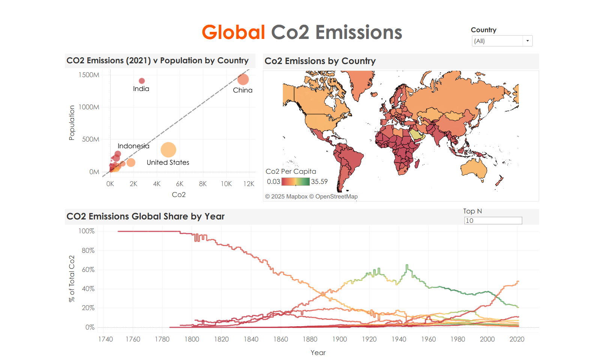

# 📊 My Tableau Projects

Welcome to my **Tableau Portfolio Repository** 🚀  
Here I’ll be uploading all my Tableau workbooks, dashboards, and practice projects as I grow my data visualization skills.  

---
## 🌟 Projects

| Project Name | Description | Preview | Tableau Public |
|--------------|-------------|---------|----------------|
| 📈 **Tableau Basics Workbook (Executive Retail Sales Analytics)** | Covers fundamentals of Tableau – bar charts, line charts, filters, parameters, and dashboards. |  | [View on Tableau Public](#) |
| 🏦 **Telco Churn Dashboard** | Customer churn analysis using IBM Telco dataset (Retention, Revenue, Churn Segments). |  | [View on Tableau Public](#) |
| 🍼 **Baby Name Trends** | Visualization of baby names dataset (1980–2010) with trends, top names, and gender distribution. |  | [View on Tableau Public](#) |
| 🌍 **Global CO₂ Emissions Dashboard** | Analysis of worldwide CO₂ emissions trends, top contributing countries, and year-over-year changes. |  | [[View on Tableau Public]](https://public.tableau.com/views/GlobalCO2Emissions_17558593960770/GlobalCo2Emissions?:language=en-US&:sid=&:redirect=auth&:display_count=n&:origin=viz_share_link)) |

---

## 🛠️ Tools & Skills
- Tableau Desktop / Tableau Public  
- Data Cleaning & Preparation  
- Dashboard Design (KPIs, Filters, Parameters)  
- Storytelling with Data  

---
## 🔗 Tableau Public Portfolio
You can explore all my published dashboards on my Tableau Public profile:  
👉 **[My Tableau Public Profile](https://public.tableau.com/app/profile/sai.ramya2926)**  

(I’ll keep updating this repo + Tableau Public with my latest work)

---

## 📜 License
This repository is licensed under the **MIT License** – free to use with attribution.  

---

✨ Stay tuned — I’ll keep adding more Tableau projects here as I learn and build!  
